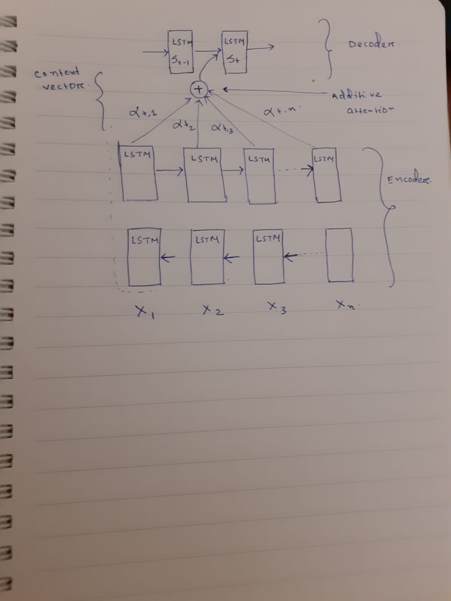

# Attention Mechanism 
* The attention mechanism is the  most influential idea in deep learning.
* It can be used in sequence model as well as convolution network.

* If a long setnece appears and you are trying to translate it through Encoder and Decoder technique .
The encoder should memorize the long setnece  into one vector . 
The decoder will  take the encoder vector and  process it generate translation
* This is a flawed method and in a real time scenario you can not wait a long sentence to be finished.
* So encoder and decoder technique performance decreses when the sentense is long 
* the performance can be checked with bleu score. x-axis is no of words

* But when humans would trnaslate this sentence, they do not read whole sentence and do not memorize it to translate .
 As one Human speaks, the other translates wihtout waiting for the complete sentence to finish
# Attention in an Image :
* In an image human visual attention allows us to focus on a certain region with high resolution,
 while perceiving the surrounding image in low resolution.

# What is attention 
* Attention is vector of  most important  weights

# Simple Architecture
let say the encoder and decoder is bidirectional LSTM.

Goal is - We are giving German languag input 
Output should be English language

* We give the german sentence to the encoder and it should generate a vector that represents the inputs.
* Now to generate the first word in English, we will make another LSTM  which is the decoder.
  Attention weights are used to specify which words are needed -  when to generate a word/output

figure - 

* alpha<1,1>, alpha<1,2>, and alpha<1,3> are the attention weights being used.

# Context vector
* to generate any word there will be a set of attention weights that controls which words we are looking at right now.
* Context vetor C is calculated with attention weights
* context vector has access to the entire input sequence.

# Note : 
* Sum of the attention weights for each element in the sequence should be 1:
# Types of Attention:
- Content-base attention
- Additive
- Location Based 
- Dot product 
- Scaled dot product

- Self Attention
- Global/soft 
- Local/hard 

